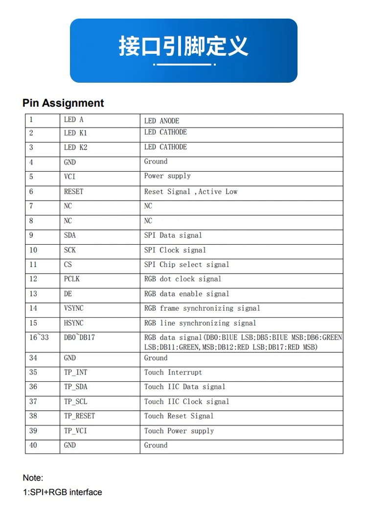
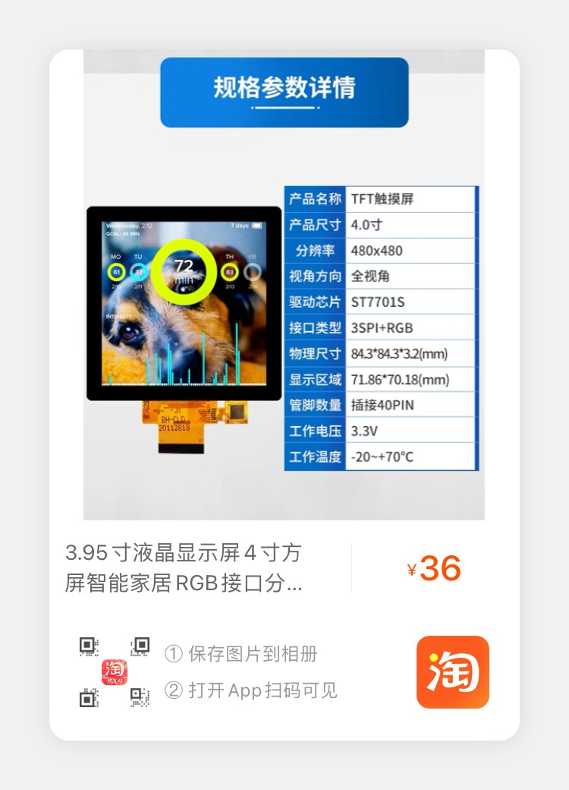

# 目的
使用esp32c3初始化宏祥瑞4寸86屏

# 驱动芯片
ST7701S

# 屏幕接线

# 屏幕介绍

# 屏幕分辨率
480*480

# 初始化代码
在ST7701S.c 文件中的9选项中
## 更改RGB顺序
```    
SPI_WriteComm(0x36); //RGB   
// SPI_WriteData(0x08); //FW:00     BW:10
SPI_WriteData(0x00); //BGR
```

# 相应命令记录

idf.py set-target esp32c3

id.py build

# 最终目标
完成触摸和屏幕显示，然后使用esp32c3画一个初始化电路板# esp32c3_rgb_4inch_86_spi_init
4inch_86_panel_initcode
